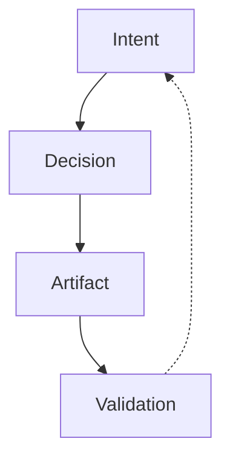

\begin{center}
\vspace*{0.18\textheight}
{\LARGE\bfseries Explicit Software Engineering Method\par}
\vspace{0.6cm}
{\Large\bfseries Version 0.1.7\par}
\vspace{0.4cm}
{\large A normative method for engineering accountability, traceability, and diagnosable failure\par}
\vspace{1cm}

\vspace{1cm}
{\large Rafael Rodríguez Ramírez\par}
\vspace{0.3cm}
{\small Generated: 2026-01-17 13:14 UTC\par}
\end{center}
\newpage
