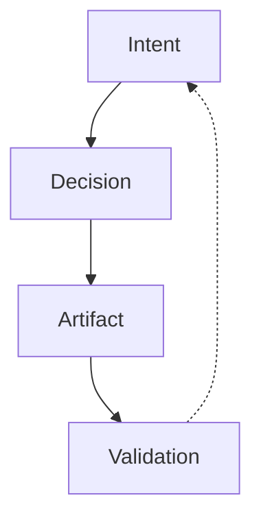

\thispagestyle{empty}
\noindent\colorbox{Navy}{\parbox{\textwidth}{\rule{0pt}{1.4cm}}}
\vspace{1cm}
\begingroup
\centering
{\LARGE\bfseries Explicit Software Engineering Method\par}
\vspace{0.35cm}
{\Large\bfseries Version 0.1.8\par}
\vspace{0.25cm}
{\normalsize A normative method for engineering accountability, traceability, and diagnosable failure\par}
\vspace{0.9cm}

\vspace{0.9cm}
{\normalsize Rafael Rodríguez Ramírez\par}
\vspace{0.2cm}
{\small Generated: 2026-01-17 14:26 UTC\par}
\endgroup
\vfill
\noindent\colorbox{CoolGray}{\parbox{\textwidth}{\rule{0pt}{0.7cm}}}
\newpage
