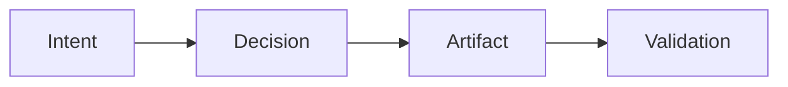

# 3. Normative Core Rules (Draft)

These rules are normative constraints and obligations of the method.
Each rule is stated to be verifiable, to imply consequences when violated, and to support analysis without dependence on tooling.
They are independent of workflow sequencing and do not prescribe a process.

## 3.0 How to Read These Rules
These rules constrain outcomes, not activity order. A team may satisfy them through different workflows and still be compliant, because the method evaluates what exists and how it is justified, not when it was produced.

Missing artifacts are allowed only through explicit compensation. Compensation is an auditable act that records accepted risk; it does not remove the underlying obligation.

Violations are diagnosable conditions, not moral failures. The intent is to make gaps observable and explainable so they can be corrected or accepted explicitly.

## 3.1 Rule 1 - Intent Declaration (Mandatory)
Every non-trivial engineering change MUST declare an explicit Intent.
Intent defines the desired outcome, property, or constraint the change aims to satisfy.
Intent MUST have a defined scope.
Changes without declared intent are considered implicit work.

This rule ensures that changes are anchored to a stated objective and can be evaluated against it, regardless of whether the work begins from code or from models.

Example: A team modifies caching behavior with the intent to reduce latency for a defined service boundary, and records that scope explicitly.

Rationale:
Without intent, no validation or traceability is possible. Quality becomes accidental.

## 3.2 Rule 2 - Decision Explicitness (Mandatory)
Every irreversible or impactful engineering decision MUST be made explicit.
A Decision MUST reference:
- the Intent it serves
- the alternatives considered (at least implicitly)
Undocumented decisions are treated as assumptions by default.

This rule preserves rationale and ensures that impactful choices can be reviewed after the fact, even when those choices are made under time pressure.

Example: Under a production deadline, a team selects a simpler data model and records the decision along with the alternative that was rejected for risk reasons.

Rationale:
Undocumented decisions prevent post-failure analysis and learning.

This diagram shows the minimal trace chain the rules expect: intent informs decisions, decisions shape artifacts, and validation ties artifacts back to their intended purpose.

## 3.3 Rule 3 - Artifact Traceability (Mandatory)
Every Artifact that affects system behavior MUST be traceable to at least one Intent or Decision.
Orphan artifacts are considered unjustified artifacts.
Traceability MUST be navigable in both directions.

This rule ensures that artifacts exist for a reason that can be located and reviewed, rather than surviving as unexplained residue of past work.

Example: A new configuration flag is linked to the decision that introduced it and the intent it was meant to satisfy.

Rationale:
Untraceable artifacts increase complexity without accountable value.

## 3.4 Rule 4 - Validation Requirement (Contextual)
Artifacts and Decisions with critical impact MUST have explicit Validation.
What is considered critical is a method parameter, not a fixed threshold.
Validation MAY take different forms:
- tests
- reviews
- proofs
- simulations
- external evidence

This rule ties validation effort to contextual criticality, allowing different forms of evidence while still requiring explicit justification for high-impact work.

Example: A high-risk change in a payment flow is validated through a targeted review and test evidence appropriate to its criticality.

Rationale:
Critical work without validation is indistinguishable from speculation.

## 3.5 Rule 5 - Assumption Declaration (Mandatory)
Assumptions MUST be explicitly declared when evidence is missing or deferred.
Assumptions MUST be identifiable as such.
Assumptions SHOULD be tracked until validated or invalidated.

This rule makes uncertainty visible and prevents hidden premises from becoming silent dependencies in the system.

Example: A team assumes an external dependency will sustain a defined throughput until benchmarks can be run, and records that assumption explicitly.

Rationale:
Implicit assumptions silently accumulate risk.

## 3.6 Rule 6 - Explicit Compensation (Mandatory)
When a required artifact or validation is missing, the absence MUST be explicitly compensated.
Compensation MUST:
- be documented
- reference the missing element
- state the accepted risk

Compensation is an explicit, auditable record of accepted risk. It does not erase the obligation; it marks a conscious deviation and allows evaluation of its impact.

Example: A hotfix is deployed without full validation, and the team records the missing validation, the accepted risk, and the follow-up plan.

Rationale:
Shortcuts are allowed; silent shortcuts are not.

## 3.7 Rule 7 - Parameter Awareness (Mandatory)
The method MUST be applied with explicit contextual parameters.
Examples of parameters:
- domain criticality
- risk tolerance
- regulatory pressure
- team scale
- expected lifespan of the system

These parameters influence:
- required explicitness level
- validation depth
- acceptable compensations

This rule ensures that obligations are applied with context, so evaluation reflects the actual risk and criticality of the work.

Example: A system in a regulated domain declares higher validation depth and stricter compensation limits than an internal prototype.

Rationale:
Quality is contextual; rigor without context is waste.

## 3.8 Rule 8 - Diagnosability of Failure (Outcome Rule)
When failure occurs, it MUST be possible to explain it in terms of method application.
At least one of the following MUST be identifiable:
- missing intent
- invalid decision
- unvalidated artifact
- false assumption
- inadequate compensation
- misconfigured parameters

This rule makes failure a traceable outcome of engineering choices, not a retrospective narrative. It enables analysis of which obligation was not met and why.

Example: After an outage, the analysis identifies an unvalidated artifact and a missing compensation record as the decisive gap.

Rationale:
If failure cannot be explained in method terms, the method was not applied.

## 3.9 Meta-Note
These rules do not describe a process.
They define constraints and obligations that must hold regardless of workflow.
That is what makes them rules of a method, not of a process.

## 3.10 Conclusion
These rules make evaluation possible by specifying what must be explicit and how gaps are recorded. They transform failure into evidence by making missing intent, decisions, assumptions, validation, or compensation observable. Because they constrain outcomes rather than activity order, they remain independent of any specific process.
