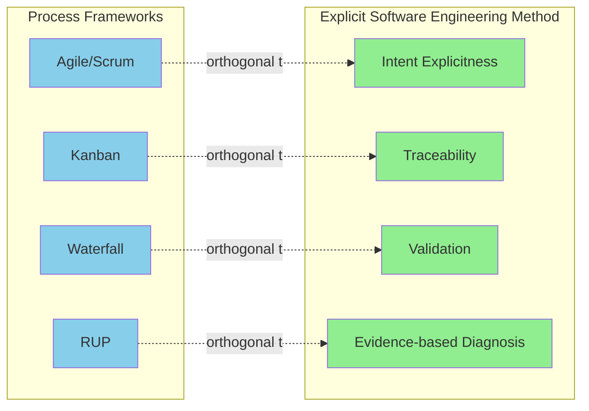
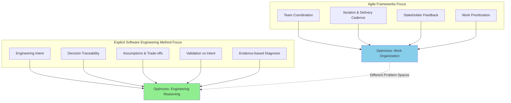
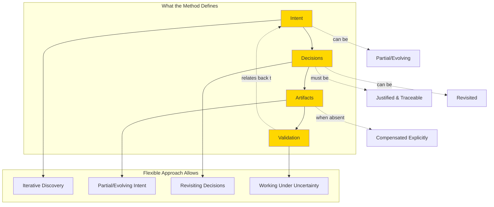
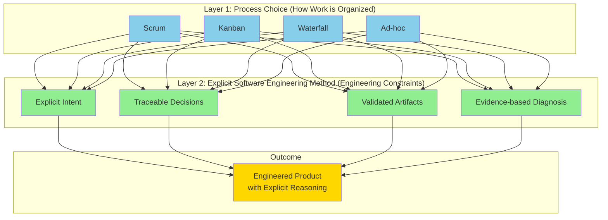
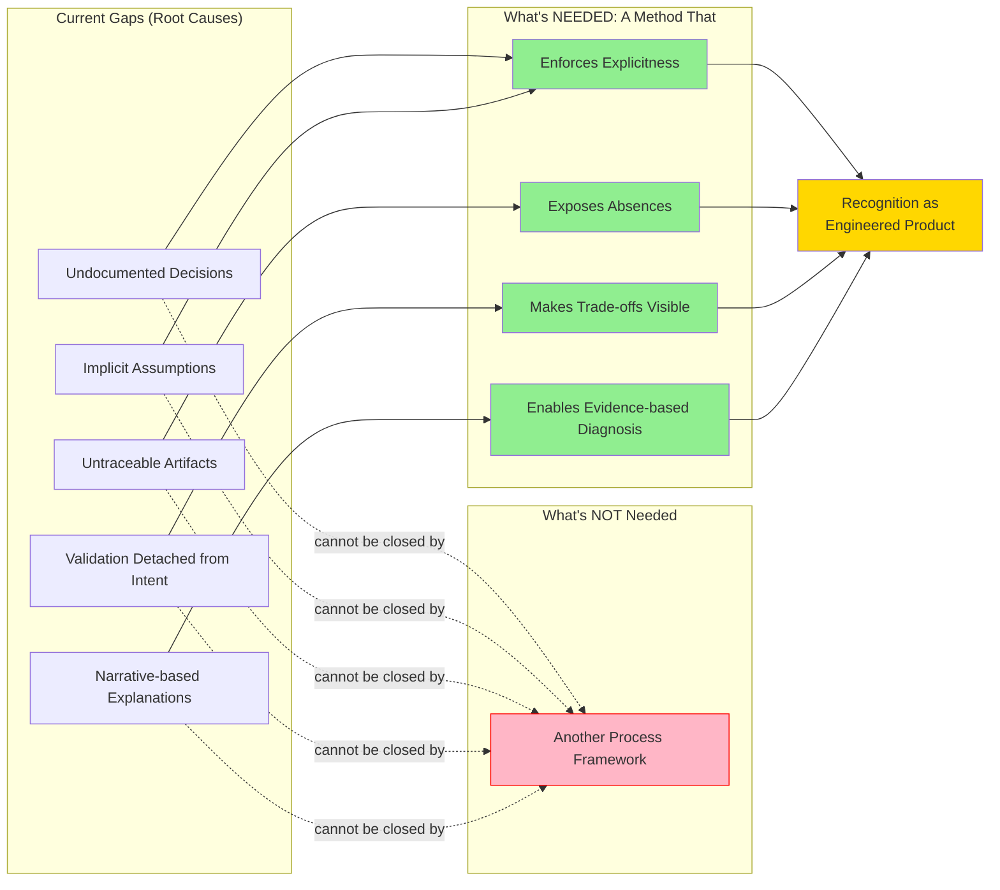

# 5. Orthogonality to Agile and Process Frameworks

The Explicit Software Engineering Method is intentionally orthogonal to Agile frameworks, process models, and workflow prescriptions.

This is a design decision, not a limitation.

## 5.1 Different Problem Spaces

Agile frameworks (such as Scrum or Kanban) primarily address:

- team coordination
- iteration and delivery cadence
- stakeholder feedback
- work prioritization

They optimize how work is organized and delivered.

The Explicit Software Engineering Method addresses a different problem:

- how engineering intent is made explicit
- how decisions are justified and traceable
- how assumptions and trade-offs are exposed
- how validation relates to intent
- how failures can be diagnosed with evidence

It optimizes how engineering reasoning is represented and evaluated, not how teams schedule or coordinate work.

## 5.2 Logical Dependencies vs Process Prescription

Software development involves real logical dependencies. For example, a solution cannot be validated without some understanding of the problem it addresses.

The method acknowledges such dependencies, but does not prescribe a fixed sequence of steps.

Instead, it defines:

- what must exist (intent, decisions, artifacts, validation)
- how these elements must relate
- how absence or incompleteness must be compensated explicitly

This allows:

- iterative discovery
- partial or evolving intent
- revisiting earlier decisions
- working under uncertainty

without enforcing a rigid lifecycle.

## 5.3 Why This Is Not Competing with Agile or RUP

The method does not attempt to replace:

- Scrum ceremonies
- backlog management
- sprint planning
- incremental delivery models

Nor does it attempt to revive heavyweight lifecycle frameworks such as RUP.

Those approaches define process structure.

This method defines engineering constraints and obligations that remain valid regardless of process choice.

A team may use:

- Scrum
- Kanban
- Waterfall
- ad-hoc exploratory workflows

and still apply the Explicit Software Engineering Method, provided that engineering work is made explicit, traceable, and analyzable.

## 5.4 Why a Method Is Sufficient

Current gaps in software development practice are not primarily caused by missing processes.

They are caused by:

- undocumented decisions
- implicit assumptions
- untraceable artifacts
- validation detached from intent
- post-failure explanations based on narrative rather than evidence

These gaps cannot be closed by introducing another process framework.

They require a method that:

- enforces explicitness
- exposes absences
- makes trade-offs visible
- allows failure to be explained in method terms

This is the role of the Explicit Software Engineering Method.

## 5.5 Summary

- **Processes organize work; the method makes engineering explicit.**
- **Agile frameworks manage delivery; the method enables diagnosis and learning.**
- **The method does not compete with processes; it constrains them.**
- **Engineering quality emerges from explicit reasoning, not from workflow choice.**

The Explicit Software Engineering Method exists to ensure that, regardless of how software is built, the result can be recognized as an engineered product rather than accidental functionality.
