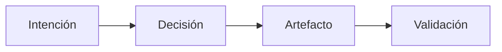

# 3. Reglas normativas centrales (borrador)

Estas reglas son restricciones y obligaciones normativas del método.
Cada regla se enuncia para ser verificable, implicar consecuencias cuando se viola y soportar análisis sin dependencia de herramientas.
Son independientes de la secuencia de trabajo y no prescriben un proceso.

## 3.0 Cómo leer estas reglas
Estas reglas restringen resultados, no el orden de las actividades. Un equipo puede cumplirlas mediante distintos flujos de trabajo y seguir siendo conforme, porque el método evalúa lo que existe y cómo se justifica, no cuándo se produjo.

La ausencia de artefactos solo se permite mediante compensación explícita. La compensación es un acto auditable que registra el riesgo aceptado; no elimina la obligación subyacente.

Las violaciones son condiciones diagnosticables, no fallas morales. La intención es hacer visibles y explicables las brechas para que puedan corregirse o aceptarse explícitamente.

## 3.1 Regla 1 - Declaración de intención (obligatoria)
Todo cambio de ingeniería no trivial DEBE declarar una Intención explícita.
La Intención define el resultado, la propiedad o la restricción deseada que el cambio busca satisfacer.
La Intención DEBE tener un alcance definido.
Los cambios sin intención declarada se consideran trabajo implícito.

Esta regla garantiza que los cambios estén anclados a un objetivo declarado y puedan evaluarse contra él, independientemente de si el trabajo inicia desde código o desde modelos.

Ejemplo: Un equipo modifica el comportamiento de la caché con la intención de reducir la latencia para un límite de servicio definido, y registra ese alcance de forma explícita.

Justificación:
Sin intención, no es posible validar ni trazar. La calidad se vuelve accidental.

## 3.2 Regla 2 - Explicitación de decisiones (obligatoria)
Toda decisión de ingeniería irreversible o de impacto DEBE hacerse explícita.
Una Decisión DEBE referenciar:
- la Intención a la que sirve
- las alternativas consideradas (al menos implícitamente)
Las decisiones no documentadas se tratan como Supuestos por defecto.

Esta regla preserva el razonamiento y asegura que las elecciones de impacto puedan revisarse a posteriori, incluso cuando se toman bajo presión de tiempo.

Ejemplo: Bajo un plazo de producción, un equipo elige un modelo de datos más simple y registra la decisión junto con la alternativa descartada por razones de riesgo.

Justificación:
Las decisiones no documentadas impiden el análisis y el aprendizaje posteriores al fallo.

Este diagrama muestra la cadena mínima de trazabilidad que esperan las reglas: la intención informa decisiones, las decisiones moldean artefactos y la validación vincula los artefactos con su propósito previsto.

## 3.3 Regla 3 - Trazabilidad de artefactos (obligatoria)
Todo Artefacto que afecte el comportamiento del sistema DEBE ser trazable a al menos una Intención o Decisión.
Los artefactos huérfanos se consideran artefactos injustificados.
La trazabilidad DEBE ser navegable en ambas direcciones.

Esta regla garantiza que los artefactos existan por una razón localizable y revisable, en lugar de sobrevivir como residuo inexplicado de trabajo pasado.

Ejemplo: Un nuevo flag de configuración se vincula con la decisión que lo introdujo y con la intención que debía satisfacer.

Justificación:
Los artefactos no trazables aumentan la complejidad sin valor responsable.

## 3.4 Regla 4 - Requisito de validación (contextual)
Los Artefactos y Decisiones con impacto crítico DEBEN tener Validación explícita.
Lo que se considera crítico es un parámetro del método, no un umbral fijo.
La Validación PUEDE adoptar distintas formas:
- pruebas
- revisiones
- pruebas formales
- simulaciones
- evidencia externa

Esta regla vincula el esfuerzo de validación con la criticidad contextual, permitiendo distintas formas de evidencia mientras exige justificación explícita para trabajo de alto impacto.

Ejemplo: Un cambio de alto riesgo en un flujo de pagos se valida mediante una revisión específica y evidencia de pruebas acorde con su criticidad.

Justificación:
El trabajo crítico sin validación es indistinguible de la especulación.

## 3.5 Regla 5 - Declaración de supuestos (obligatoria)
Los Supuestos DEBEN declararse explícitamente cuando falta evidencia o se difiere.
Los Supuestos DEBEN ser identificables como tales.
Los Supuestos DEBERÍAN seguirse hasta ser validados o invalidados.

Esta regla hace visible la incertidumbre y evita que premisas ocultas se conviertan en dependencias silenciosas del sistema.

Ejemplo: Un equipo asume que una dependencia externa sostendrá un throughput definido hasta que puedan ejecutarse benchmarks, y registra ese supuesto de forma explícita.

Justificación:
Los supuestos implícitos acumulan riesgo en silencio.

## 3.6 Regla 6 - Compensación explícita (obligatoria)
Cuando falta un artefacto o validación requerida, la ausencia DEBE compensarse explícitamente.
La Compensación DEBE:
- estar documentada
- referenciar el elemento faltante
- declarar el riesgo aceptado

La compensación es un registro explícito y auditable de riesgo aceptado. No elimina la obligación; marca una desviación consciente y permite evaluar su impacto.

Ejemplo: Se despliega un hotfix sin validación completa, y el equipo registra la validación faltante, el riesgo aceptado y el plan de seguimiento.

Justificación:
Se permiten atajos; no se permiten atajos silenciosos.

## 3.7 Regla 7 - Conciencia de parámetros (obligatoria)
El método DEBE aplicarse con parámetros contextuales explícitos.
Ejemplos de parámetros:
- criticidad del dominio
- tolerancia al riesgo
- presión regulatoria
- escala del equipo
- vida útil esperada del sistema

Estos parámetros influyen:
- nivel requerido de explicitud
- profundidad de validación
- compensaciones aceptables

Esta regla asegura que las obligaciones se apliquen con contexto, de modo que la evaluación refleje el riesgo y la criticidad reales del trabajo.

Ejemplo: Un sistema en un dominio regulado declara mayor profundidad de validación y límites de compensación más estrictos que un prototipo interno.

Justificación:
La calidad es contextual; el rigor sin contexto es desperdicio.

## 3.8 Regla 8 - Diagnosabilidad del fallo (regla de resultado)
Cuando ocurre un fallo, DEBE ser posible explicarlo en términos de la aplicación del método.
Al menos uno de los siguientes DEBE ser identificable:
- intención ausente
- decisión inválida
- artefacto no validado
- supuesto falso
- compensación inadecuada
- parámetros mal configurados

Esta regla hace del fallo un resultado trazable de decisiones de ingeniería, no una narrativa retrospectiva. Permite analizar qué obligación no se cumplió y por qué.

Ejemplo: Después de una caída, el análisis identifica un artefacto no validado y un registro de compensación ausente como brecha decisiva.

Justificación:
Si el fallo no puede explicarse en términos del método, el método no se aplicó.

## 3.9 Meta-nota
Estas reglas no describen un proceso.
Definen restricciones y obligaciones que deben cumplirse independientemente del flujo de trabajo.
Eso es lo que las convierte en reglas de un método, no de un proceso.

## 3.10 Conclusión
Estas reglas hacen posible la evaluación al especificar qué debe ser explícito y cómo se registran las brechas. Transforman el fallo en evidencia al hacer observables la intención, decisiones, supuestos, validación o compensación faltantes. Como restringen resultados en lugar del orden de actividad, permanecen independientes de cualquier proceso específico.
